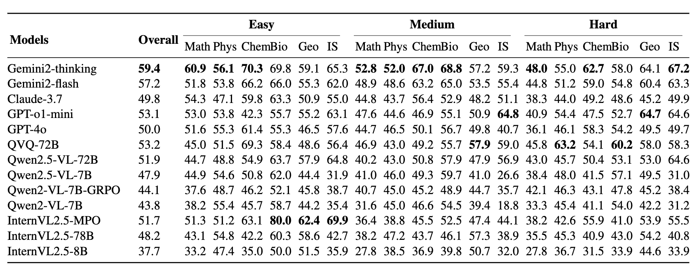

# MDK12-Bench

[**🏗️ Quickstart**](MDK12EvalHub/README.md) | [**📊 Datasets**](#-datasets) | [**🏆 Leaderboard**](#-leaderboard) | [**📝 Report**](https://arxiv.org/abs/2504.05782) | [**🖊️ Citation**](#-citation)

This repository is the official implementation of [MDK12-Bench](https://arxiv.org/abs/2504.05782).

> [MDK12-Bench: A Multi-Discipline Benchmark for Evaluating Reasoning in Multimodal Large Language Models](https://arxiv.org/abs/2504.05782)  
> Pengfei Zhou*, Fanrui Zhang*, Xiaopeng Peng*, Zhaopan Xu, Jiaxin Ai, Yansheng Qiu, Chuanhao Li, Zhen Li, Ming Li, Yukang Feng, Jianwen Sun, Haoquan Zhang, Zizhen Li, Xiaofeng Mao, Zekai Li, Wangbo Zhao, Kai Wang, Xiaojun Chang, Wenqi Shao, Yang You†, Kaipeng Zhang† <br>
> <sup>\*</sup> Equal Contribution  
> <sup>†</sup> Corresponding Author

## 🆕 News

- **[2025-04-09]** The technical report of [MDK12-Bench](https://arxiv.org/abs/2504.05782) is released!

## 📖 Introduction

MDK12-Bench is a comprehensive benchmark designed to evaluate the reasoning capabilities of Multimodal Large Language Models (MLLMs) across multiple disciplines. Our benchmark covers a diverse range of tasks that require high-level reasoning abilities, providing a robust platform for challenging and assessing state-of-the-art MLLMs. MDK12-Bench aims to push the boundaries of multimodal intelligence by offering standardized evaluation metrics and high-quality test cases that reflect real-world reasoning scenarios.

## 🏗️ Quick Start

Please refer to [Quickstart](MDK12EvalHub/README.md) for your quick start.

After setting up the environment following instructions in [Handbook](MDK12EvalHub/docs/Quickstart.md), you may refer to `quick-inference-qwenvl.py` for a very quick inference using [vLLM](https://github.com/vllm-project/vllm) project. Then you may directly refer to `judge.sh` to use our judge logic for evaluating the inference results and obtaining the final performance score. Make sure the API for judge model is set in `MDK12EvalHub/.env` before you run the `judge.sh`.

<a id="-datasets"></a>
## 📊 Datasets

To be released.

<a id="-leaderboard"></a>
## 🏆 Leaderboard

**The performance score of accuracy on our official leaderboards can be briefly previewed here!**



<a id="-citation"></a>
## 🖊️ Citation 
If you feel MDK12-Bench useful in your project or research, please kindly use the following BibTeX entry to cite our paper. Thanks!
```bibtex
@misc{zhou2025mdk12,
      title={MDK12-Bench: A Multi-Discipline Benchmark for Evaluating Reasoning in Multimodal Large Language Models}, 
      author={Pengfei Zhou and Fanrui Zhang and Xiaopeng Peng and Zhaopan Xu and Jiaxin Ai and Yansheng Qiu and Chuanhao Li and Zhen Li and Ming Li and Yukang Feng and Jianwen Sun and Haoquan Zhang and Zizhen Li and Xiaofeng Mao and Wangbo Zhao and Kai Wang and Xiaojun Chang and Wenqi Shao and Yang You and Kaipeng Zhang},
      year={2025},
      eprint={2504.05782},
      archivePrefix={arXiv},
      primaryClass={cs.CV},
      url={https://arxiv.org/abs/2504.05782}, 
}
